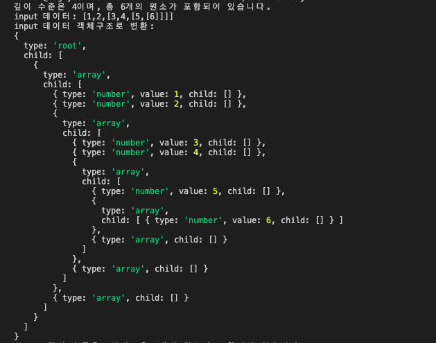
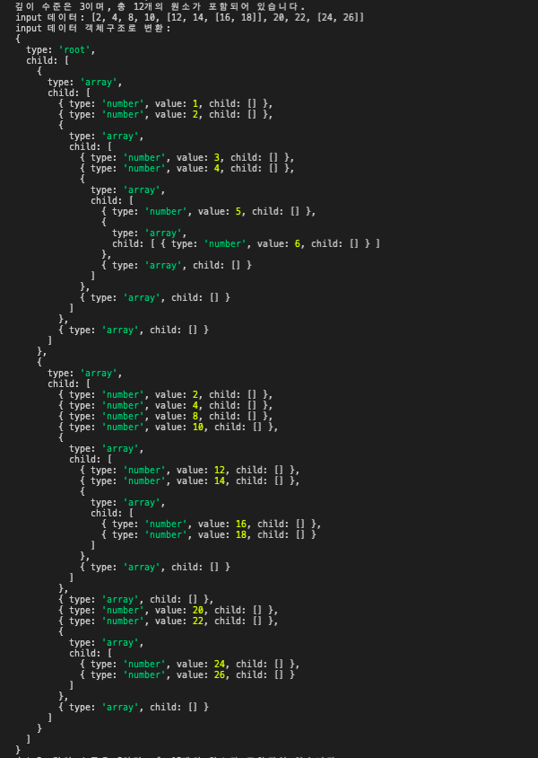
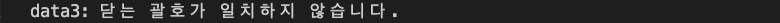

# 2020.11.11 Daily Mission

---

<br>

## Mission 1. 괄호문법 검사기 🧐

다음과 같이 배열형태의 데이터에는 숫자가 포함되어 있다.
모든 숫자는 특이하게도 괄호('()')에 의해서 감싸져 있다.
괄호는 중첩되서 표현된다. 중첩은 무한대로 될 수 있다.

```
const data = "[1,2,[3,4,[5,[6]]]]"
```

<br>

### 문제1. 객체 분석 정보를 출력

```
const data = "[1,2,[3,4,[5,[6]]]]"
run(data)
> "깊이 수준은 4이며, 총 6개의 원소가 포함되어 있습니다"
```

<br>

### 문제2. 괄호가 매칭에 문제가 있는 경우 오류내용을 출력한다.

```
const data = "[1,2,[3,4,[5,[6]]"
run(data);
> '닫는 괄호가 일치하지 않습니다'
```

<br>

### 문제3. (선택) 배열 분석 정보를 출력한다.

```
const data = "[1,2,[3,4,[5,[6]]]"
>
run(data) >
  {
    type: "root",
    child: [
      {
        type: "array",
        child: [
          {
            type: "number",
            value: "1",
            child: [],
          },
          {
            type: "number",
            value: "2",
            child: [],
          },
          {
            type: "array",
            child: [
              {
                type: "number",
                value: "3",
                child: [],
              },
              {
                type: "number",
                value: "4",
                child: [],
              },
              {
                type: "array",
                child: [
                  {
                    type: "number",
                    value: "5",
                    child: [
                      {
                        type: "array",
                        child: [
                          {
                            type: "number",
                            value: "6",
                            child: [],
                          },
                        ],
                      },
                    ],
                  },
                ],
              },
            ],
          },
        ],
      },
    ],
  };
```

<br>
<br>

### 힌트

- 문제를 단순화 해서 해결해본다. 예를들어 이런 문자열부터 분석해보기

```
const data = "[1]"
```

- 문자열을 iteration하면서 의미있는 단위(토큰)를 추출하고 이를 분석한다. 예를들어 괄호('[') 나 숫자(1,2,3..)등이 토큰이다.
- 데이터 파싱을 하는 단계에서, stack 자료구조를 활용할 수 있다. 예를들어 괄호('[')문자를 찾은후에는 닫는 괄호(']')가 나올때까지 스택자료구조를 활용해서 데이터를 모은다.

### 학습 체크포인트 :white_check_mark:

- stack과 queue 차이점과 활용점을 안다.
- 무한중첩된 구조를 재귀와 스택자료구조를 활용해서 분석할 수 있다.

<br>

## 실행결과

<data1("[1,2,[3,4,[5,[6]]]]") 실행결과>



<br>

<data2("[2, 4, 8, 10, [12, 14, [16, 18]], 20, 22, [24, 26]]") 실행결과>



<br>

<data3("[1,2,[3,4,[5,[6]]") 실행결과>


