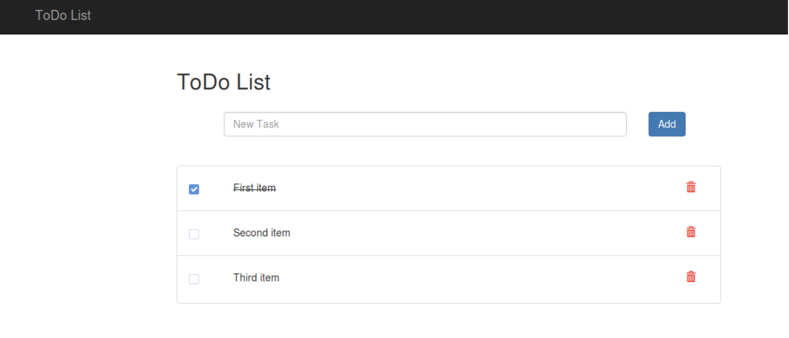
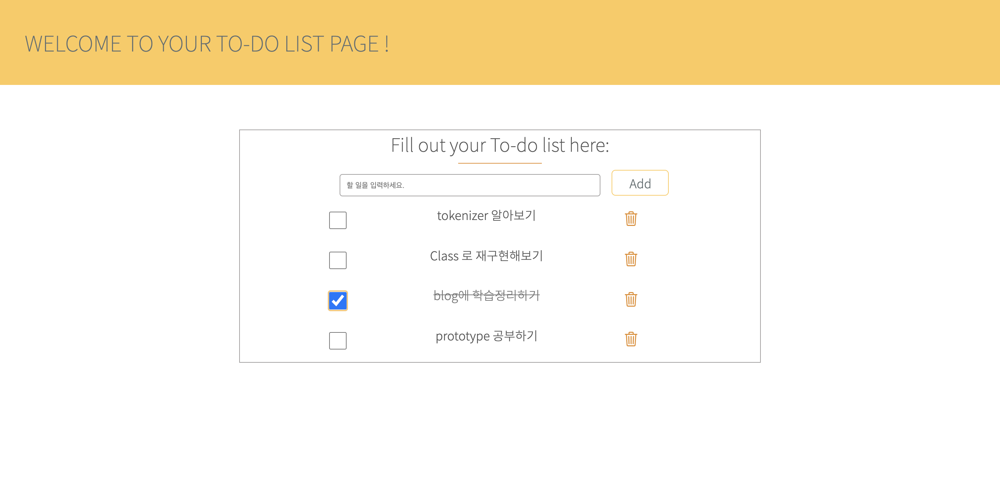

# 2020.11.16 Daily Mission

---

 

## Mission 1. 웹 TODO 개발

아래와 같은 TODO(할일관리) 웹 애플리케이션을 만든다.

다음의 조건을 만족하도록 한다.

- 스타일(css)은 단순하게 한다.
- 할일을 입력하면 리스트에 노출
- 리스트에 체크박스를 누르면 완료된 일로 노출(취소선)
- 휴지통을 누르면 삭제
- 그외에 필요한 기능을 추가하는 것 가능

 

## Mission 2. 웹 TODO 개발

같은 동작을 객체지향적으로 개발한다.

- ES Classes를 사용한다.
- 2 개의 클래스를 만든다.
  1. todolist를 처리하는 Model Class
  2. 화면을 업데이트하는 view Class

 

## 학습 체크포인트 :white_check_mark:

- DOM 노드를 탐색하고, 추가하는 API를 안다.
- Event를 등록하고 Event listener 등록할 수 있다.
- 객체를 2개이상 나누고 이를 서로 연관지어 프로그램을 구현할 수 있다.

 

## 실행결과

<a href="https://codepen.io/letsBeCodeGenius/pen/bGeJpzM" target="_blank">코드펜에서 직접 실행해보기</a>

