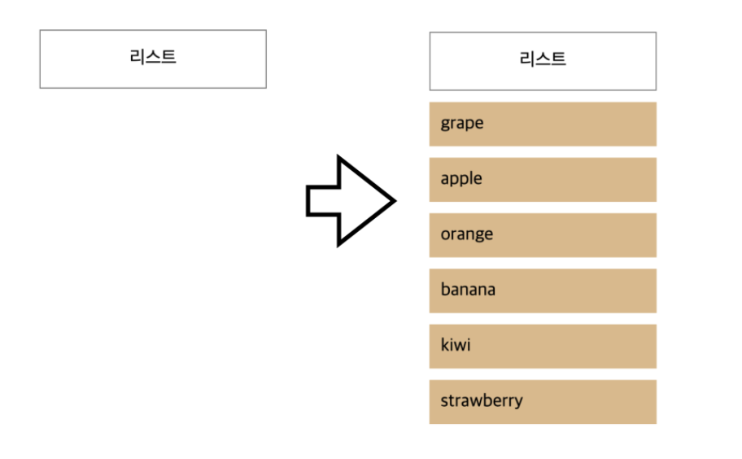
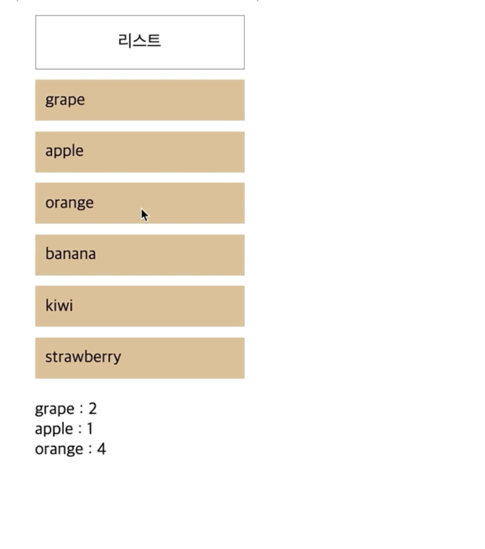
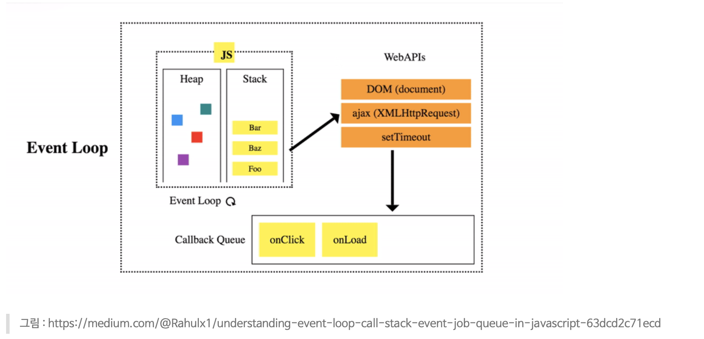

# 2020.11.23 Daily Mission

---

 

## Mission 1. 스마트 드롭다운 메뉴

리스트 영역에 마우스를 1초 이상 머무는 경우 오른쪽처럼 레이어가 노출된다.
1초 미만으로 머무는 경우(다시 말해 1초안에 지나가는 경우)에는 레이어가 노출되지 않는다.

 

## Mission 2. 마우스 이동정보 기록

리스트 안에서 마우스를 이동할때마다 그 횟수를 기록한다.
mousemove이벤트가 발생할때마다 기록하지 않고, 500ms 마다 한 번씩만 기록된다.
아래그림에서는 grape가 한번 기록되고 1500ms 동안 3번정도 기록된것을 볼 수 있다.
기록정보는 마우스가 움직일때마다 계속 업데이트 된다.

 

## Mission 3. 동료에게 설명하기 <피어세션에서 설명>

setTimeout과 같은 비동기를 다루는 함수의 동작은 동기적인(순차적으로 실행되는)실행과 다르게 동작한다.
call stack와 event queue(callback queue라고도 한다)에 대해서 공부한다.
아래 그림과 같은 것을 통해서 setTimeout의 동작의 흐름을 이야기할 수 있도록 공부한다.

문제1,2 구현코드에 대해서 call stack와 event queue의 관계 위주로 동작을 설명한다.

 

## 실행결과
