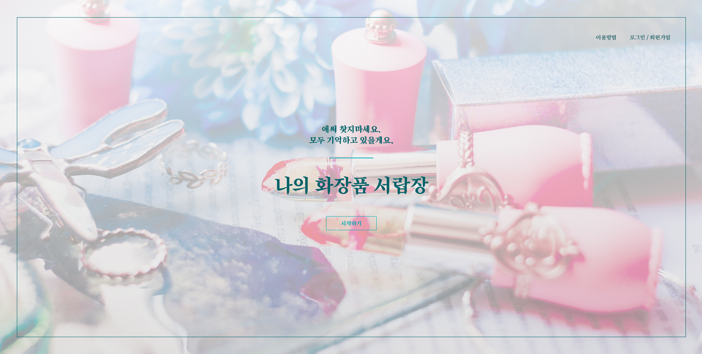
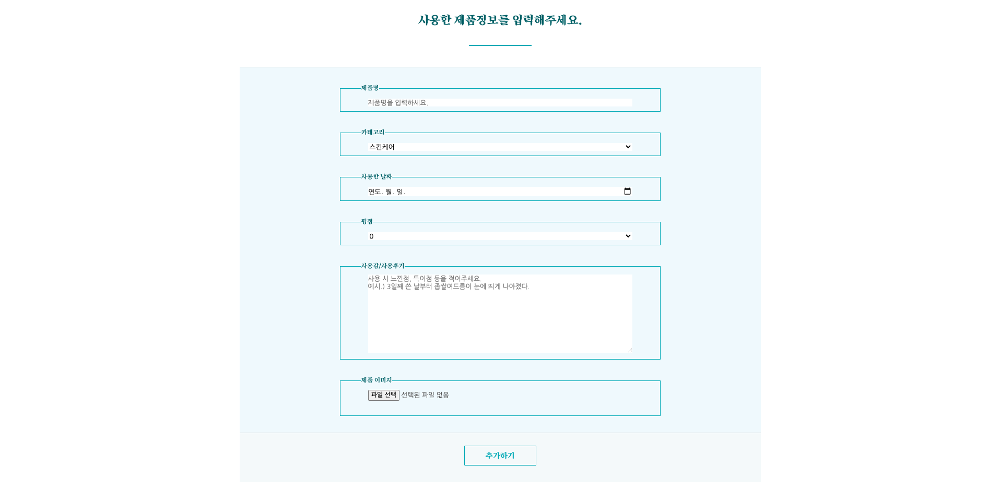
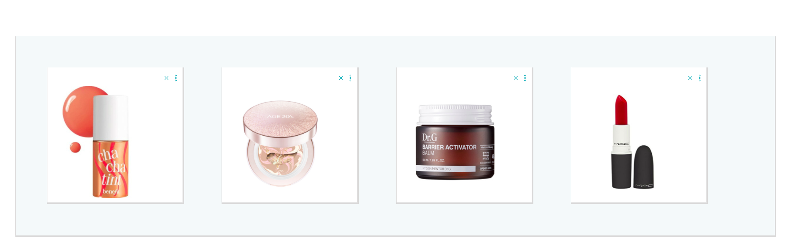
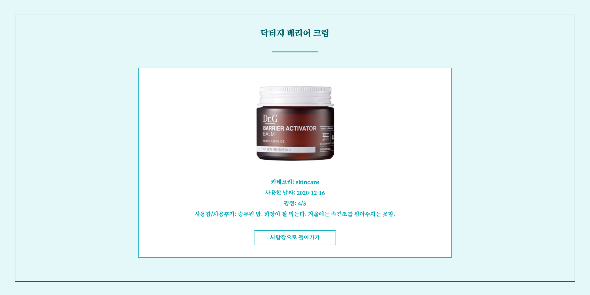

# 2020.11.30 Final Project

---

# 나의 화장품 서랍장 (MY MAKE-UP DRAWER)

## 사용 목적  

사용한 제품정보 및 사용후기를 기록하는 기능을 수행한다. 
용기나 겉포장을 폐기처분 하더라도 UI로 사용했던 기록을 한눈에 볼 수 있게 함으로써 사용했던 제품의 제품명이나 사용감을 기억하고싶은 사용자의 편의성을 높인다.

## UI 이미지  

- <커버 이미지>   
- <입력페이지 이미지>   
- <서랍장 이미지>   
- <상세페이지 이미지> 
